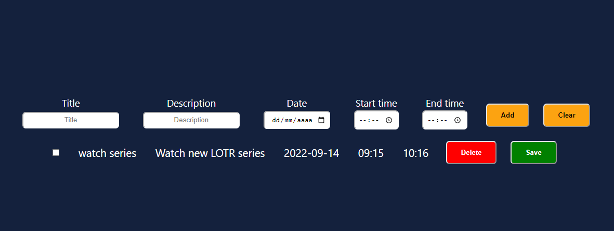

# Todo List APP



> A todo list app that consumes an api

### Adjust and enchancement

This project is not done yet, still dev and want add some features like:

[] - Add users and logins

## 💻 Pré-requisites

Before you run, check if you attend to requisites below:

* You have the latest version of `<nodejs / npm>`
* You have installed all dependencies with npm `<npm install>`
* You have a `<Windows / Linux / Mac>` machine.

## 🚀 Instaling <Pokedex>

To install <Todo List App>, follow this steps:

Windows:
Clone repository:
```
on aplication folder, open console and type:
<npm install>
```

## ☕ Using <Pokedex>

To use <Todo List App>, follow this steps:

```
on aplication folder, open console and type:
<npm run dev / npm run build && npm start>
```

[⬆ Back to top](#todo-list-app)<br>
